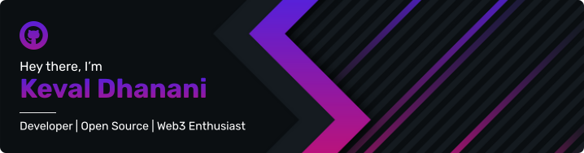

<h1 align="center"> Welcome to my GitHub profile </h1>
I'm a final year student pursuing a Bachelors's in Computer Engineering. I have a strong passion for programming and am constantly striving to improve my skills and knowledge. I'm skilled at building efficient web applications that provide a seamless user experience. I love to explore new technologies and am currently learning about Web3 and UI/UX. I am looking to collaborate on open-source projects that will help me brush up on my skills.

<h2 align="center"> You Can Find Me Here 👨‍💻 </h2>

  
  
  

 
<h2 align="center"> Langauges, Frameworks and Tools I Have Worked With </h2>

  
  
  
  
  
  
  
  
  
  
  
  
  
  
  
  
  
  
  

 
<h1 align="center"> GitHub Statistics </h1>

  
    
    
  

  

